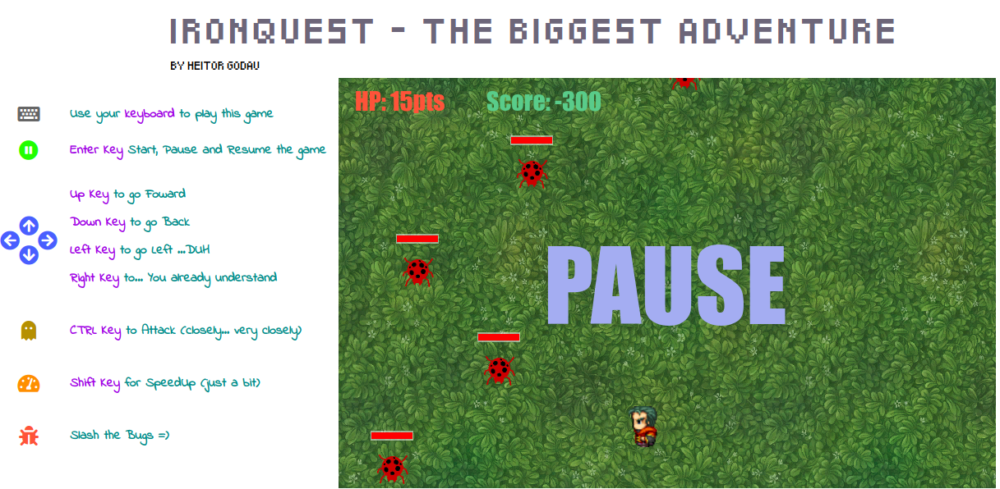
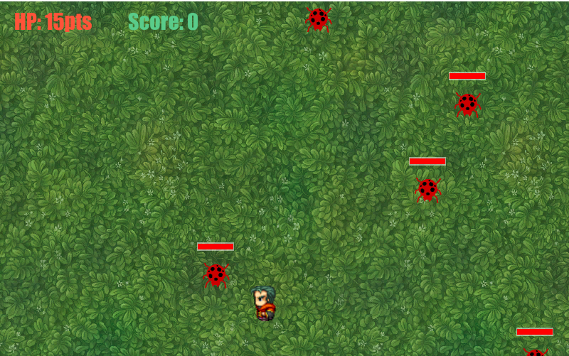

# IronQuest - The Biggest Adventure
> "IronQuest" is a game build in HTML canvas, CSS and Javascript.
> This game is in beta version 1.2.1
#### TLDR: https://heitorgodau.github.io/ironquest-the-game/

## Installation

Clone or download this project to play.

## Usage example

Instructions to play this game:

* Use your Keyboard
* Enter Key is used to Begin the game, pause and resume
* Up Key to go foward
* Down key to go back
* Left Key to go left... Duh
* Right Key to... You already understand
* CTRL Key to Attack (closely... very closely)
* Shift Key to Speed up (just a bit)
* Slash the Bugs =]

## Release History

* 1.2.1
    * CHANGE: Minor bugs fixed
* 1.2.0
    * CHANGE: Enemys lifebar are implemented
* 1.1.0
    * CHANGE: Background music and sound FX are implemented
* 1.0.0
    * First functional release
* 0.4.0
    * CHANGE:  Hero, Enemy and Background design are implemented
* 0.3.1
    * FIX: Hero moviment bugs
    * FIX: Hero/enemy collision
* 0.3.0
    * CHANGE: Collision logic was implemented
* 0.2.0
    * CHANGE: Enemys and Hero moviment was implemented 
* 0.1.0
    * CHANGE: Little squares are added
* 0.0.1
    * Initial files added

## Meta

Heitor Godau – [@heitorgodau](https://twitter.com/heitorgodau) – heitorgodau@gmail.com

Distributed under the Creative Commons license - Attribution-NonCommercial 4.0 International (CC BY-NC 4.0). See CC LICENSE for more information.

[https://github.com/heitorgodau/github-link](https://github.com/heitorgodau/)

## Contributing
>This is a free software, feel free to contribute in any way you want

1. Fork it (<https://github.com/heitorgodau/IronQuest-The-Game/fork>)
2. Create your feature branch (`git checkout -b feature/fooBar`)
3. Commit your changes (`git commit -am 'Add some fooBar'`)
4. Push to the branch (`git push origin feature/fooBar`)
5. Create a new Pull Request
